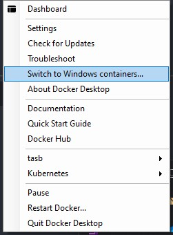
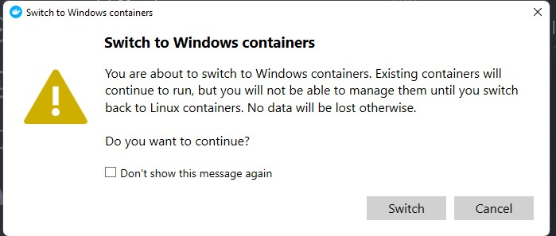

# Lab 01 - Introduction to containers

On this lab you'll start to have contact with docker CLI and container lifecycle.

## On this lab

- [Initial steps](lab01.md#initial-steps)
- [Play with a container](lab01.md#play-with-a-container)
- [Run an App](lab01.md#run-an-app)
- [Windows Containers](lab01.md#windows-containers)

## Initial steps

Start to check if docker is running properly on your machine with the following command:

```bash
docker --version
```

The output should be something like:

```bash
Docker version 20.10.12, build e91ed57
```

Let's run your first container:

```bash
docker run hello-world
````

And you get an output like this:

```bash
Hello from Docker!

This message shows that your installation appears to be working correctly.

...
```

## Play with a container

Let's play with Busybox. [Busybox](https://hub.docker.com/_/busybox) is a container maintained by Docker community and have a lot usage since combines tiny versions of many common UNIX utilities into a single small executable.

To get started, let's download the image to our local cache.

```bash
docker pull busybox
```

Let's check if the images was properly downloaded to our local cache.

```bash
docker images
```

You should see something like this.

```bash
REPOSITORY   TAG       IMAGE ID       CREATED      SIZE
busybox      latest    ec3f0931a6e6   3 days ago   1.24MB
```

Ok! Now you have the image on our local cache. Let's run it?

```bash
docker run busybox
```

Hum... There is a bug! Nothing happened right? If you recall, the duration of a container execution is connected with the duration of the process defined to be executed (your app!).

On this case, Busybox by default don't have any blocking process defined as default process so when you execute it an instance of the image is created, a process is executed and the container quits.

Let's try another approach.

```bash
docker run busybox echo "Hello world"
```

On this run you'll see the message you wrote and then the container quits again because 'echo' process is not blocking as well.

Let's look into the status of our containers.

```bash
docker ps
```

You should not see any container on the list since this command only lists running containers.

Let's list all containers.

```bash
docker ps -a
```

Now you see a list of all containers that are running or stopped.

You can remove a stopped container using a direct command.

```bash
docker rm <CONTAINER_ID>
```

Or if you can remove all stopped containers using 'prune' command. After executing it you need to confirm you want to remove all containers.

```bash
docker container prune
```

Let's proceed to a more complex scenario.

## Run an App

Let's start with something more interesting and we'll run a simple static website.

```bash
docker run -d -P --name my-static-website tasb/hello-static-site
```

Let's look into all parts of this command:

- docker run: Tells docker to instantiate a container using an image
- -d: means running in detached mode
- -P: means to map all container opened ports to random host ports
- --name my-static-website: gives an user specified name to the container instead a random one
- tasb/hello-static-site: image to be used to create the container

And how can I know the port that docker selected on my host? It's easy, let's run this command.

```bash
docker port my-static-website
```

You should see an output similar to this one.

```bash
80/tcp -> 0.0.0.0:32769
```

Now you can open your browser and navigate to <http://localhost:32769> (change the port number with the one you got from the output of previous command)

If you don't want docker to select ports randomly you can select the port explicitly on the run command.

```bash
docker run -d -p 8080:80 tasb/hello-static-site
```

Now you can navigate to <http://localhost:8080>

Having 2 instances of same image running you can stop the first one.

```bash
docker stop my-static-website
```

Let's check the list of running containers

```bash
docker ps
```

And now the list of all containers

```bash
docker ps -a
```

If you need another instance you can start again the initial container

```bash
docker start my-static-website
```

Now that you managed containers lifecycle, let's remove all of them. Since you have the containers running you need to force the remove command.

```bash
docker rm -f $(docker ps -aq)
```

## Windows Containers

**ONLY FOR WINDOWS MACHINES!**

First let's move from Linux Containers to Windows Containers. Right-click on docker icon on Windows system tray and select option "Switch to Windows Containers..." as next image.



Then you get an warning about this switch and you need to confirm the switch.



After waiting a couple of minutes your docker is ready to run Windows Containers.

Let's execute a simple webpage based on aspnet.

```bash
docker run -d -p 9000:80 mcr.microsoft.com/dotnet/samples:aspnetapp
```

Run your browser and navigate to <http://localhost:9000> to see the website and check you're running on a Windows Container.

You can now clean up all running containers and switch to Linux Containers again to be prepared for the next lab.

```bash
docker rm -f $(docker ps -aq)
```

Congratulations! You've completed Lab01 - Introduction to containers!

## Next Lab: [How to create my own container >](lab02.md)

[Return home >](../README.md#labs)
