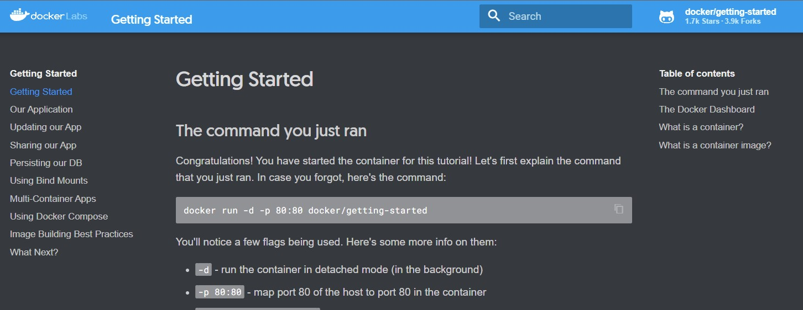
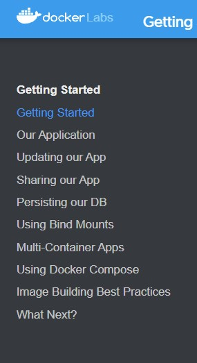

# Additional lab - Let’s put all together

On this lab you'll have a change to put all things together that we learned during first four session.

## Build Lab instructions

For get this lab instruction you need to run a container.

I'll share with you some details about this image and you need to find the command by yourself.

Details:

- Image name: docker/getting-started
- Container port: 80
- Host port: 8080
- Run mode: detached.

Did you managed to get the command? If not, click on below link.

  
Click to see the command

  <code>
  docker run -dp 8080:80 docker/getting-started
  </code>

## Run the lab

After that navigate to <http://localhost:8080> you should get an web page like this.

You must follow in sequence the links on left-side menu.

Have fun!

## Next Lab: [Introduction to Kubernetes >](lab05.md)

[Return home >](../README.md#labs)
