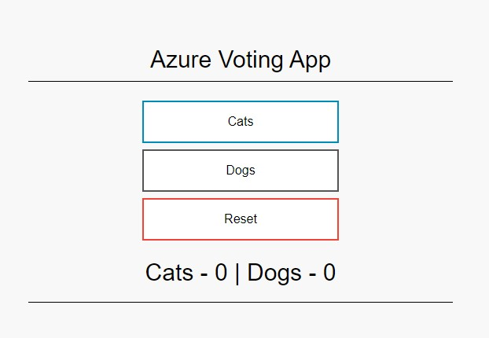

# Lab 05 - Introduction to Kubernetes

On this lab you'll have a first hands-on experience with Kubernetes.

## On this lab

- [Prepare your machine](lab05.md#prepare-your-machine)
- [Set context](lab05.md#set-context)
- [Run your first pod](lab05.md#create-images)
- [Using manifests](lab05.md#using-manifests)
- [Pod advanced configuration](lab05.md#pod-advanced-configuration)
- [Work with namespaces](lab05.md#work-with-namespaces)

## Prepare your machine

Before you start this lab you need to make sure you have your machine ready to use a Kubernetes dev cluster.

First, enable `minikube` cluster on your machine.

```bash
minikube start --extra-config=kubelet.housekeeping-interval="10s"
```

When you start `minikube` cluster, `kubectl` is automatically configured. Let's confirm it's working properly.

```bash
kubectl version
```

You may have an output similar with this.

```bash
Client Version: version.Info{Major:"1", Minor:"22", GitVersion:"v1.22.0", GitCommit:"c2b5237ccd9c0f1d600d3072634ca66cefdf272f", GitTreeState:"clean", BuildDate:"2021-08-04T18:03:20Z", GoVersion:"go1.16.6", Compiler:"gc", Platform:"windows/amd64"}
Server Version: version.Info{Major:"1", Minor:"21", GitVersion:"v1.21.9", GitCommit:"88ccc7584c4460cf46e4180be83e7c4ab7a8ffb4", GitTreeState:"clean", BuildDate:"2022-01-30T02:57:18Z", GoVersion:"go1.16.12", Compiler:"gc", Platform:"linux/amd64"}
```

## Set Context

Now you need to configure the context of `kubectl` tool to be set for Kubernetes cluster configured by Docker Desktop.

Let's list all available contexts.

```bash
kubectl config get-contexts
```

On the list you get, you'll have a line with a `*` on CURRENT column. This represent the current context set for `kubectl`tool.

To have direct access to current context you may run the following command.

```bash
kubectl config current-context
```

If the output of this command is not `minikube`, you need to change your current context.

```bash
kubectl config use-context minikube
kubectl config current-context
```

Now you should get `minikube` as the output of last commands.

## Run your first pod

Getting a first pod running on Kubernetes can be done using an imperative command.

We'll use a previously created image during containers labs.

```bash
kubectl run my-simple-site --image=tasb/hello-static-site --port=80 
```

Let's list all running pods to check if your pod is running properly.

```bash
kubectl get pods
```

You should get the following output.

```bash
NAME             READY   STATUS    RESTARTS   AGE
my-simple-site   1/1     Running   0          42s
```

On `STATUS` column you need to have `RUNNING` value.

Now let's interact with our website.

```bash
kubectl port-forward my-simple-site 8080:80
```

Navigate to <http://localhost:8080> to check that your website is working properly.

To exit port-forward you can user `Ctrl+C` on the terminal.

Let's delete our pod to keep Kubernetes clean.

```bash
kubectl delete pod my-simple-site
```

## Using manifests

Using a declarative configuration is the recommended way to interact with Kubernetes.

To create the same pod using this approach, create a file called `pod.yaml` with the following content. You need to be careful when add content to the file since whitespace have semantic value on YAML.

```yaml
apiVersion: v1
kind: Pod
metadata:
  name: my-simple-website
spec:
  containers:
  - image: tasb/hello-static-site
    name: my-simple-site
    ports:
    - containerPort: 80
```

To send this manifest to Kubernetes use the next command.

```bash
kubectl apply -f pod.yaml
```

And let's check if the pod is running properly using the following command.

```bash
kubectl get pods
```

You should see `Running` on Status column on returned list.

Now it's time to test our pod.

```bash
 kubectl port-forward my-simple-website 8080:80
```

Navigate to <http://localhost:8080> to check that your website is working properly.

To exit port-forward you can user `Ctrl+C` on the terminal.

Now you will deploy a different version of that pod using the same file only changing image name.

On `pod.yaml` file change image to `tasb/hello-static-site:k8s` and run `apply` command again.

```bash
kubectl apply -f pod.yaml
```

And let's check if the pod is running properly.

```bash
kubectl get pods
```

You should see `Running` on Status column on returned list.

Now let's interact with our new website.

```bash
kubectl port-forward my-simple-website 8080:80
```

Navigate to <http://localhost:8080> to check that your website is working properly.

To exit port-forward you can user `Ctrl+C` on the terminal.

Let's delete our pod to keep Kubernetes clean.

```bash
kubectl delete pod my-simple-website
```

## Pod advanced configuration

Now you'll create a more complex pod with additional configuration.

First, if you need to enable metrics server on your cluster.

```bash
minikube addons enable metrics-server
```

You should get this output.

```bash
    ▪ Using image k8s.gcr.io/metrics-server/metrics-server:v0.4.2
🌟  The 'metrics-server' addon is enabled
```

This component may take some time to be ready. To test if it's working properly execute the following command.

```bash
kubectl top nodes 
```

When everything is working properly you should get an output like this.

```bash
NAME       CPU(cores)   CPU%   MEMORY(bytes)   MEMORY%
minikube   255m         3%     4Mi             0%
```

Now you need to create a file called `vote-app.yaml` with the following content. You need to be careful when add content to the file since whitespace have semantic value on YAML.

```yaml
apiVersion: v1
kind: Pod
metadata:
  name: vote-app
spec:
  containers:
    - name: azure-vote-back
      image: mcr.microsoft.com/oss/bitnami/redis:6.0.8
      ports:
        - containerPort: 6379
      env:
        - name: ALLOW_EMPTY_PASSWORD
          value: "yes"
      resources:
        limits:
          cpu: 1000m
          memory: "1G"
        requests:
          cpu: 500m
          memory: "500M"
    - name: azure-vote-front
      image: mcr.microsoft.com/azuredocs/azure-vote-front:v1
      ports:
        - containerPort: 80
      env:
        - name: REDIS
          value: localhost
      resources:
        limits:
          cpu: 1000m
          memory: "1G"
        requests:
          cpu: 500m
          memory: "500M"
```

On this manifest, you're creating a single pod with two containers: redis database and voting website.

Let's dig on specific parts of manifest.

```yaml
env:
- name: REDIS
  value: localhost
```

On this block you defined a environment variable to be set on container startup to define where website can find the Redis database.

You use `localhost` as value since the two containers communicate using IPC (Inter Process Communication).

```yaml
resources:
  limits:
    cpu: 1000m
    memory: "1G"
  requests:
    cpu: 500m
    memory: "500M"
```

On this block you defined the resources requests and limits for each container. Requests needs to be met by scheduler when selecting the node. Limits represent the maximum amount of each resource that the container can consume.

Let's run this pod.

```bash
kubectl apply -f vote-app.yaml
```

And let's check if the pod is running properly.

```bash
kubectl get pods
```

You should get an output like this.

```bash
NAME       READY   STATUS    RESTARTS   AGE
vote-app   2/2     Running   0          79m
```

On `READY`column you see `2/2` that means you have 2 containers running inside this pod.

To get more details about this pod you may try the following command.

```bash
kubectl describe pod vote-app
```

Take some time to look into all the details from this pod.

Then you need to make a port forwarding to have access to this website.

```bash
kubectl port-forward vote-app 8080:80
```

Now it's time to navigate to <http://localhost:8080> and have access to voting app website.

You should get an webpage like this.



Please make your votes clicking on "Cats" and "Dogs" to make changes on the values.

Now we'll enter Redis container to check the changes on data. Open a new terminal window and execute the following command.

```bash
kubectl -it exec vote-app -c azure-vote-back -- bash
```

Inside the container use Redis client to make some data queries. To start Redis client, use the following command inside the container.

```bash
redis-cli
```

After getting access to Redis, execute the following commands to get data from database.

```bash
keys *
get Cats
get Dogs
```

You should get the same numbers that you see on website.

To return to your terminal you need to execute **2 times** `exit` command.

## Work with namespaces

On this final topic you will see how namespaces works.

First, create a new namespace.

```bash
kubectl create ns my-ns
```

You still have your voting app running on `default` namespace and now you'll create a new pod on new namespace.

```bash
kubectl apply -f vote-app.yaml -n my-ns
```

On the command you added `-n my-ns` option to inform Kubernetes that you want to create this pod on namespace `my-ns`.

From now on, you need to add this option on all your commands to interact with resources available on this namespace.

Let's check if new pod is running properly.

```bash
kubectl get pods -n my-ns
```

You can see that the name of the pod is exactly the same that the previous one that you created. Since they are in different namespace this is possible to happen.

Let's try to have access to this webapp.

```bash
kubectl port-forward vote-app -n my-ns 9000:80
```

Now it's time to navigate to <http://localhost:9000> and have access to voting app website.

You should get an webpage like this with 0 votes.


Please make your votes clicking on "Cats" and "Dogs" to make changes on the values.

To stop port forwarding use `Ctrl+c` on the terminal.

It's time for clean up.

All resources that exists on a namespace are delete when you delete the namespace.

```bash
kubectl delete ns my-ns
```

The first voting app is still running and to delete it use the following command.

```bash
kubectl delete pod vote-app
```

## Next Lab: [Deployment lifecycle >](lab06.md)

[Return home >](../README.md#labs)
