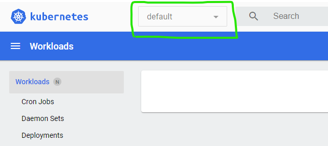

# Lab 09 - Monitoring and Operation

On this lab you'll see how HPA works and have look into Kubernetes Dashboard.

## On this lab

- [Prepare your cluster](lab09.md#prepare-your-cluster)
- [Create Sample App](lab09.md#create-sample-app)
- [Add Load Generator](lab09.md#add-load-generator)
- [Enable Kubernetes Dashboard](lab09.md#enable-kubernetes-dashboard)
- [Enable HPA](lab09.md#enable-hpa)
- [Scale Down](lab09.md#scale-down)
- [Cleanup Cluster](lab09.md#cleanup-cluster)

## Prepare your cluster

<span style="color:red">If you already have done this on [Lab05](lab05.md#pod-advanced-configuration) you may skip this step.</span>

Before you're able to use HPA and Kubernetes Dashboard, you need to have Metrics server running inside your cluster.

Usually when you're using a full Kubernetes cluster this step is ot need as Metrics Server is included on Kubernetes installation.

Since you're using local Kubernetes cluster you need to install it.

Create a file called `metrics-server.yaml` and add the content available on [this link](https://gist.github.com/tasb/4667515a028f929af3a6a18d609d0c82).

Then you need to apply it:

```bash
kubectl apply -f metrics-server.yaml
```

This component may take some time to be ready. To test if it's working properly execute the following command.

```bash
kubectl top nodes 
```

When everything is working properly you should get an output like this.

```bash
NAME             CPU(cores)   CPU%   MEMORY(bytes)   MEMORY%
docker-desktop   238m         2%     2396Mi          30%
```

## Create Sample App

For this lab you will use a sample image that have an endpoint `/load` that makes some calculation to cause CPU usage.

Create a file named `hpa-sample-dep.yaml` and add the following content.

```yaml
apiVersion: apps/v1
kind: Deployment
metadata:
  name: hpa-sample
spec:
  selector:
    matchLabels:
      run: hpa-sample
  replicas: 1
  template:
    metadata:
      labels:
        run: hpa-sample
    spec:
      containers:
      - name: hpa-sample
        image: tasb/hpa-dotnet-sample:v1
        ports:
        - containerPort: 80
        resources:
          limits:
            cpu: 500m
          requests:
            cpu: 100m
---
apiVersion: v1
kind: Service
metadata:
  name: hpa-sample-svc
  labels:
    run: hpa-sample
spec:
  ports:
  - port: 8080
    targetPort: 80
  selector:
    run: hpa-sample
```

You may check that on this file you have two manifest: one for the deployment and other for the service. This is a usual way to author your Kubernetes manifest and uses an YAML specification keyword (`---`) to split objects inside the same file.

Now, let's create this deployment, starting with creating a namespace.

```bash
kubectl create ns hpa-sample
```

Then apply the deployment and the service.

```bash
kubectl apply -f hpa-sample-dep.yaml -n hpa-sample
```

Check everything is working properly listing main objects on `hpa-sample` namespace.

```bash
kubectl get all -n hpa-sample
```

## Add Load Generator

Next step you have create a deployment that only causes load on a Kubernetes service. You need this to see HPA working.

This deployment uses a simple image that uses a environment variable `URL_TEST` and do an infinite loop making calls to that URL. This image you can use on this lab or anywhere else you need to cause load on our Kubernetes services.

Create a file named `load-gen-dep.yaml` and add the following content.

```yaml
apiVersion: apps/v1
kind: Deployment
metadata:
  name: load-generator
spec:
  selector:
    matchLabels:
      run: load-generator
  replicas: 1
  template:
    metadata:
      labels:
        run: load-generator
    spec:
      containers:
      - name: load-generator
        image: tasb/load-generator:env
        imagePullPolicy: Always
        env:
          - name: URL_TEST
            value: 'http://hpa-sample-svc:8080/load'
```

Recall that you're setting `URL_TEST` environment variable with value `http://hpa-dotnet-svc:8080/load` pointing to previously created service.

Now apply this deployment to `hpa-sample` namespace.

```bash
kubectl apply -f load-gen-dep.yaml -n hpa-sample
```

Check everything is working properly listing main objects on `hpa-sample` namespace.

```bash
kubectl get all -n hpa-sample
```

## Enable Kubernetes Dashboard

Enabling Kubernetes Dashboard means applying a deployment to your cluster.

To be able to have access to data on that dashboard you need to create an user with admin privileges on the cluster and using a login token from it.

To speed up this steps uou may find scripts that do all the steps for you on following links:

- If you're using Windows, you have a Powershell script on this [link](https://gist.githubusercontent.com/tasb/023bb87949c430ce3b8eed35e47e54b7/raw/f3470ca18bbf27652b8e125984bdda7a4b3dd7c1/dashboard.ps1)
- If you're using Windows, you have a bash script on this [link](https://gist.githubusercontent.com/tasb/be560770b580e81afde36abb00b5d344/raw/2a51c2163702cb7becf35f5d37b29bbeb0602e45/dashboard.sh)

After create a script on your computer, run that script. You should get an output like this.

```bash
namespace/kubernetes-dashboard configured
serviceaccount/kubernetes-dashboard configured
service/kubernetes-dashboard configured
secret/kubernetes-dashboard-certs configured
secret/kubernetes-dashboard-csrf configured
secret/kubernetes-dashboard-key-holder configured
configmap/kubernetes-dashboard-settings configured
role.rbac.authorization.k8s.io/kubernetes-dashboard configured
clusterrole.rbac.authorization.k8s.io/kubernetes-dashboard configured
rolebinding.rbac.authorization.k8s.io/kubernetes-dashboard configured
clusterrolebinding.rbac.authorization.k8s.io/kubernetes-dashboard configured
deployment.apps/kubernetes-dashboard configured
service/dashboard-metrics-scraper configured
deployment.apps/dashboard-metrics-scraper configured
serviceaccount/admin-user configured
clusterrolebinding.rbac.authorization.k8s.io/admin-user configured

Use this token on Kubernetes Dashboard

--------------------------------------------------------------

eyJhbGciOiJSUzI1NiIsImtpZCI6IkM4MzBuVUJrSzNabjJfVUpWdkVpTDBETEd0NG9RaEswYmoya29taU1PTHcifQ......

--------------------------------------------------------------
```

Copy the token (the value between `--------------------------------------------------------------` lines) that you will need to login on Kubernetes Dashboard.

To have access to Kubernetes Dashboard you need to open a proxy between your machine and Kubernetes API server.

To do that `kubectl` has a command to speed up the process. Run the following command on your command line to create (be aware that your command line will be blocked by this command).

```bash
kubectl proxy
```

After that, open a browser window and navigate to <http://localhost:8001/api/v1/namespaces/kubernetes-dashboard/services/https:kubernetes-dashboard:/proxy/>.

You should get access to a login page like this one.



On this login page you have to enter the token you copied previously on input text with `Enter token *` placeholder.

Click on `Sign In` button and you should get a dashboard like this.


To get metrics from `hpa-sample` namespace you need to change to that namespace on namespace selector on top of Kubernetes Dashboard.


Leave this browser window open that could allow you to see the behavior of your cluster when you start to add more load to it.

## Enable HPA

First you'll change the number of replicas of Load Generator deployment to cause more demand on HPA Sample pods.

You can do it changing Manifest file created for this deployment but now you'll use a `kubectl` command to do this change.

Execute the following command to change the number of replicas on `load-generator` deployment to 5.

```bash
kubectl scale --replicas=5 deploy/load-generator -n hpa-sample
```

Check everything is working properly listing main objects on `hpa-sample` namespace.

```bash
kubectl get all -n hpa-sample
```

Let's check how the resources usage are for each pod. To do that, run the following command to have a list of pods and the CPU and memory each one is using.

```bash
kubectl top pods -n hpa-sample
```

Please notice that the metrics server may took some time until give you metrics for all pods, so you may need to run this command several times.

When you have details from every pod you should see an output like this.

```bash
NAME                              CPU(cores)   MEMORY(bytes)
hpa-dotnet-7bbb5c64cd-hnsph       496m         23Mi
load-generator-76f879f6c8-9ghzg   26m          0Mi
load-generator-76f879f6c8-kvjkw   26m          0Mi
load-generator-76f879f6c8-lz5rk   28m          0Mi
load-generator-76f879f6c8-nvblt   26m          0Mi
load-generator-76f879f6c8-zsbxv   28m          0Mi
```

Since we defined a CPU usage limit of `500m` for HPa Sample pods you may notice that the CPU usage of the only node of that deployment is reaching the maximum value.

Let's create an HPA that allow this deployment to have better performance due to more demand that we caused.

Create a file called `hpa.yaml` and add the following content.

```yaml
apiVersion: autoscaling/v2beta2
kind: HorizontalPodAutoscaler
metadata:
  name: hpa-sample
spec:
  scaleTargetRef:
    apiVersion: apps/v1
    kind: Deployment
    name: hpa-sample
  minReplicas: 2
  maxReplicas: 12
  metrics:
  - type: Resource
    resource:
      name: cpu
      target:
        type: AverageValue
        averageValue: 250m
```

On this HPA object we are defining that `hpa-sample` deployment must have at least 2 replicas and at most 12 replicas.

```yaml
minReplicas: 2
maxReplicas: 12
```

Then is defined that the metric that HPA should look is CPU usage and should take some action when average CPU consumption of all deployment pods reach `250m`.

```yaml
metrics:
- type: Resource
  resource:
    name: cpu
    target:
      type: AverageValue
      averageValue: 250m
```

Let's apply HPA to your cluster.

```bash
kubectl apply -f hpa.yaml -n hpa-sample
```

Let's check how HPA is working to automatically scale HPA Sample deployment.

```bash
kubectl get hpa -n hpa-sample
```

Like the `top` command, the process of HPA can take a little bit so you should make the following check several times until get a proper outcome.

After some minutes you should get an output like this.

```bash
NAME         REFERENCE               TARGETS     MINPODS   MAXPODS   REPLICAS   AGE
hpa-dotnet   Deployment/hpa-dotnet   239m/250m   2         12        9          7m57s
```

Notice that `TARGETS` column describe `actual/desired` metric value.

After reaching an actual metric value smaller than the desired metric value, the HPA stops to increase replicas number meaning HPA Sample deployment reached a stable behavior.

Let's check how the resources usage are for each pod. To do that, run the following command to have a list of pods and the CPU and memory each one is using.

```bash
kubectl top pods -n hpa-sample
```

## Scale down

Finally let's decrease load on this deployment decreasing Load Generator deployment number of replicas.

```bash
kubectl scale --replicas=1 deploy/load-generator -n hpa-sample
```

With this command, 4 replicas from this deployment will be terminated and the demand on HPA Sample will decrease.

Regarding this change, HPA should start to decrease number of replicas on HPA Sample.

Check how HPA is changing the number of replicas.

```bash
kubectl get hpa -n hpa-sample
```

You should get an output similar with this.

```bash
NAME         REFERENCE               TARGETS    MINPODS   MAXPODS   REPLICAS   AGE
hpa-dotnet   Deployment/hpa-dotnet   52m/250m   2         12        9          29m
```

You may notice that actual metric value decreased a lot but you still have 9 replicas.

HPA takes some time to start to decrease the number of replicas and do it only after several intervals (each interval with 15 seconds) observing lower demand on deployment.

Remember the formula used to calculate the optimal number of replicas.

```bash
desiredReplicas = ceil[currentReplicas * ( currentMetricValue / desiredMetricValue )]
```

After some minutes you may check HPA details and observe that the number of replicas already decreased.

```bash
kubectl get hpa -n hpa-sample
```

Getting an output like this.

```bash
NAME         REFERENCE               TARGETS     MINPODS   MAXPODS   REPLICAS   AGE
hpa-dotnet   Deployment/hpa-dotnet   157m/250m   2         12        3          34m
```

## Cleanup Cluster

Now that you finished this lab you may clean up your cluster deleting the namespace that will delete all the objects created inside it.

```bash
kubectl delete ns hpa-sample
```

## Next Lab: [Connect all the dots >](lab10.md)

[Return home >](../README.md#labs)
