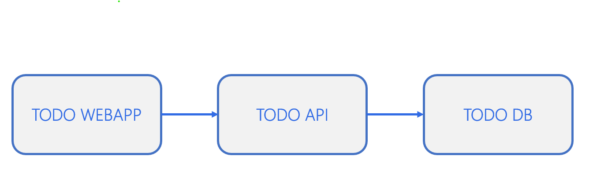
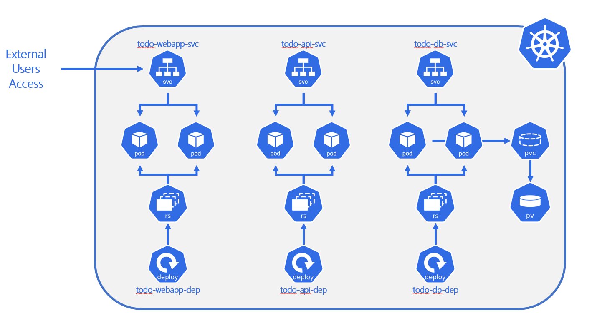

# Lab 10 - Connect all the dots

On this lab you'll build Dockerfiles and Kubernetes manifests for an app.

## On this lab

- [Prerequisites](lab10.md#prerequisites)
- [Goals](lab10.md#goals)
- [Todo App Components](lab10.md#todo-app-components)
- [Kubernetes architecture](lab10.md#kubernetes-architecture)

## Prerequisites

You'll deploy a simple Todo App on your Kubernetes cluster.

First, download source code available on this [link](https://github.com/tasb/todo-app/archive/refs/tags/v1.zip).

Unzip it on your machine and open the VS Code (or another code editor) on root folder.

Then, confirm that you have Docker and Kubernetes cluster running on your machine.

## Goals

On this lab you'll have the following goals:

- **Create Dockerfiles for webapp and api**
- **Create Docker compose scripts**
- **Push to Docker hub**
- **Create Kubernetes Manifests**
  
  - **Deployments**
  - **Services**
  - **PersistentVolume and PersistentVolumeClaim**
  - **ConfigMaps and Secrets**

## Todo App Components

Todo App is a basic 3-tier application with the following components.



Let's deep dive on [Todo DB](lab10.md#todo-db), [Todo API](lab10.md#todo-api) and [Todo WebApp](lab10.md#todo-webapp).

### Todo DB

This component is implemented using a Microsoft SQL Server 2017.

**Details**:

- Image: `mcr.microsoft.com/mssql/server:2017-latest`
- Data must be persistent
- Needs two enviroment variables

  - `ACCEPT_EULA=Y` (static value)
  - `SA_PASSWORD`, with the value you want (notice connection string on [Todo API](lab10.md#todo-api))

**Tasks**:

- Create Kubernetes Deployment and Services to run this workload
- Create additional objects to configure properly this workload

### Todo API

This component is implemented using a .NET 6 Minimal API web app.

**Details**:

- Endpoints available on `/todos/`
- Connects to [Todo DB](lab10.md#todo-db)
- Connection string on environment variable `ConnectionStrings__TodosDb`

**Tasks**:

- Create Dockerfile using multi-stage
- Create Kubernetes Deployment and Services to run this workload
- Create additional objects to configure properly this workload

### Todo WebApp

This component is implemented using a .NET 6 MVC web app.

**Details**:

- Webapp available on `/` or `/todo`
- Connects to [Todo API](lab10.md#todo-api)
- API URL defined on environment variable `Services.TodoAPI`. This variable must contain complete URL (p. ex., `http://URL/todos`)

**Tasks**:

- Create Dockerfile using multi-stage
- Create Kubernetes Deployment and Services to run this workload
- Create additional objects to configure properly this workload

### Additional Details

To compile a .NET project you need to perform the following tasks.

```bash
dotnet restore "MyProject.csproj"
dotnet build "MyProject.csproj" -c Release -o /app/build
dotnet publish "MyProject.csproj" -c Release -o /app/publish /p:UseAppHost=false
```

## Kubernetes Architecture

Regarding Kubernetes components, you may check the final architecture on next image.



At the end of this lab you should get on your cluster an outcome like you see on previous image.

Create all needed files and deploy to your container.

At the end you should navigate to <http://localhost> and should get and use Todo App.

## Congratulations

You've finished all the labs!

Hopefully you feel more prepared about containers and kubernetes.

Well Done!
