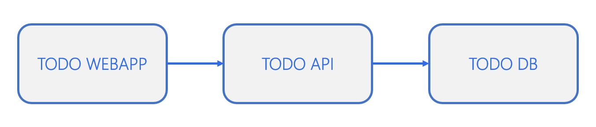

# ToDo App - Dockerfile and Docker compose

On this step #1 you'll build Dockerfile and docker compose files for ToDo App

## On this lab

- [Prerequisites](#prerequisites)
- [Goals](#goals)
- [Todo App Components](#todo-app-components)

## Prerequisites

You'll deploy a simple Todo App on your Kubernetes cluster.

First, download source code available on this [link](https://github.com/tasb/todo-app-dotnet-psql/archive/refs/tags/v1.zip).

Unzip it on your machine and open the VS Code (or another code editor) on root folder.

Then, confirm that you have Docker and Kubernetes cluster running on your machine.

## Goals

On this lab you'll have the following goals:

1. Create Dockerfile for webapp and api
2. Push to Docker hub
3. Create Docker compose files to run your app
  
## Todo App Components

Todo App is a basic 3-tier application with the following components.



### Todo DB

This component is implemented using a PostreSQL 14.

**Details**:

- Image: `postgres:14.2-alpine`
- Data must be persistent
  - Folder where PostreSQL keeps data: `/var/lib/postgresql/data`
- Needs two environment variables

  - `POSTGRES_USER`, with the value you want (notice connection string on [Todo API](lab10.md#todo-api))
  - `POSTGRES_PASSWORD`, with the value you want (notice connection string on [Todo API](lab10.md#todo-api))

### Todo API

This component is implemented using a .NET 6 Minimal API web app.

**Details**:

- Endpoints available on `/todos/`
- Connects to [Todo DB](#todo-db)
- Connection string on environment variable `ConnectionStrings__TodosDb` with following format
  - `User ID=<USERNAME>;Password=<PASSWORD>;Server=tododb;Port=5432;Database=TodoDb;Integrated Security=true;Pooling=true;`
  - Recall that you need to change username and password with chosen values on Database configuration

### Todo WebApp

This component is implemented using a .NET 6 MVC web app.

**Details**:

- Webapp available on `/` or `/todo`
- Connects to [Todo API](lab10.md#todo-api)
- API URL defined on environment variable `Services__TodoAPI`. This variable must contain complete URL (p. ex., `http://URL/todos`)

### Additional Details

To compile a .NET project you need to perform the following tasks.

```bash
dotnet restore "MyProject.csproj"
dotnet build "MyProject.csproj" -c Release -o /app/build
dotnet publish "MyProject.csproj" -c Release -o /app/publish /p:UseAppHost=false
```

You can take a look on the sample [EchoApp](https://github.com/tasb/docker-kubernetes-training/tree/main/src/EchoApp) used during session demos.
