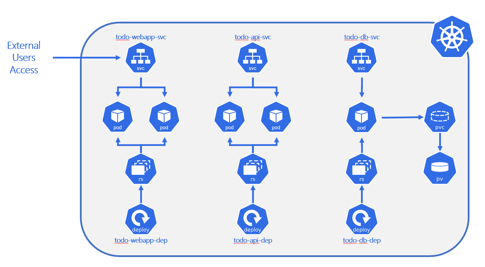

# ToDo App - Kubernetes

On this lab you'll build kubernetes manifest files to run your app

## On this lab

- [Prerequisites](#prerequisites)
- [Goals](lab10.md#goals)
- [Todo App Components](lab10.md#todo-app-components)
- [Kubernetes architecture](lab10.md#kubernetes-architecture)

## Prerequisites

You should finish [Step #1](step01.md) in order to have your images available on Docker Hub and testes your app running using docker compose.

## Goals

On this lab you'll have the following goals:

- Create Kubernetes Manifests
  - Deployments
  - Services
  - PersistentVolume and PersistentVolumeClaim
  - ConfigMaps and Secrets
- Run your application on local Kubernetes using a specific namespace

## Todo App Components

Todo App is a basic 3-tier application with the following components.

Let's deep dive on [Todo DB](lab10.md#todo-db), [Todo API](lab10.md#todo-api) and [Todo WebApp](lab10.md#todo-webapp).

## Kubernetes Architecture

Regarding Kubernetes components, you may check the final architecture on next image.

At the end of this lab you should get on your cluster an outcome like you see on previous image.

Create all needed files and deploy to your cluster.

At the end you should navigate to <http://localhost> and should get and use Todo App.

## Congratulations

You've finished your ToDo App running on Kubernetes cluster!
